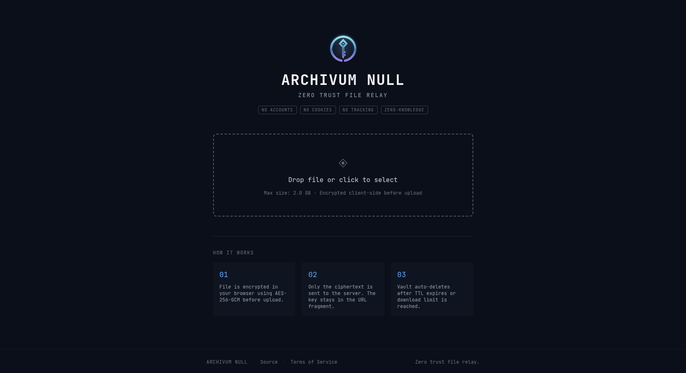

<div align="center">
    
<br \><br \>

# Archivum Null

> Anonymous encrypted file sharing for privacy-first users — zero-knowledge, no accounts, self-hostable.

<br />

[](https://github.com/whiteravens20/archivum-null/actions/workflows/test.yml)
[](https://github.com/whiteravens20/archivum-null/actions/workflows/docker-snapshot.yml)
[](https://github.com/whiteravens20/archivum-null/actions/workflows/release.yml)
[](https://github.com/whiteravens20/archivum-null/actions/workflows/codeql.yml)
[](https://github.com/whiteravens20/archivum-null/actions/workflows/security.yml)

<br />


</div>



**Why this exists:** Firefox Send is gone, croc and Magic Wormhole need a CLI on both ends, and most "secure" web uploaders ask you to sign in. Archivum Null is browser-only, account-free, end-to-end encrypted in the page, and self-hostable on a $5 VPS or a homelab box.

---

## Try It Now

**Working demo:** [archivum.wrservices.link](https://archivum.wrservices.link) — share a file in seconds, no install, no signup. The demo runs the same image you'd self-host; uploads expire automatically.

Or spin it up locally in one command — requires only Docker:

```bash
git clone https://github.com/whiteravens20/archivum-null.git
cd archivum-null
docker compose -f docker-compose.quickstart.yml up -d
```

Then open **http://127.0.0.1:3000** in your browser.

> ⚠️  This uses a default admin password (`quickstart-change-me`). Change it before any real use — see [Production](#production) for the full hardening checklist.

---

## Prerequisites

There are two supported paths:

1. **Docker demo** above — fastest way to see it run.
2. **Local Node.js dev** — clone the repo and run backend + frontend with `npm run dev`. No Docker required.

The table below lists the only hard requirement and optional conveniences.

### Required (always)

| Requirement | Notes |
|---|---|
| Node.js 24+ | Both backend and frontend; declared in each `package.json` |

### Optional — containerised setup

| Option | Notes |
|---|---|
| Docker 24+ & Docker Compose | Convenient wrapper around Node — not required; use if you prefer containers or want the production image |

### Recommended for public / production deployment

| Recommendation | Why it matters if skipped |
|---|---|
| Domain name pointed at a public IP | Without one, the service is reachable only on a local network or raw IP — fine for personal/homelab use |
| VPS running a reverse proxy (nginx, Caddy, …) | Without TLS termination, traffic is unencrypted in transit; the browser will block WebCrypto on non-HTTPS origins (see [Troubleshooting](#troubleshooting)) |
| Private tunnel (WireGuard, SSH, VPN overlay) | Without a tunnel, port 3000 must be exposed directly to the internet — significantly higher attack surface |
| Cloudflare Turnstile | Without it, upload abuse protection relies on rate limiting alone; Turnstile verification is automatically skipped when keys are not set |

> **Quickest local start:** `cd backend && npm install && npm run dev` in one terminal, `cd frontend && npm install && npm run dev` in another. Open `https://localhost:5173` (accept the self-signed cert once — required for WebCrypto).

## Architecture

```
┌──────────────────────────────────────────────────────────┐
│  Browser (Client)                                        │
│                                                          │
│  1. Select file                                          │
│  2. Generate AES-256-GCM key (WebCrypto)                 │
│  3. Encrypt file client-side (streaming per-chunk)       │
│     Plaintext split into 5 MB chunks, each encrypted     │
│     independently: AES-256-GCM with unique IV + AAD      │
│     (chunk index prevents reordering attacks)            │
│  4. Upload ciphertext to server                          │
│  5. Receive vault URL:                                   │
│       /vault/{id}#BASE64_KEY.BASE64_FILENAME             │
│                                                          │
│  Key and filename NEVER leave the browser via HTTP.      │
│  URL fragment (#) is NOT included in HTTP requests.      │
└──────────────────────────────────────────────────────────┘
               │ HTTPS (encrypted blob + vault config only)
               ▼
┌──────────────────────────────────────────────────────────┐
│  Server                                                  │
│                                                          │
│  Stores only:                                            │
│  - vault_id                                              │
│  - ciphertext (encrypted blob — filename/MIME inside)    │
│  - created_at / expires_at                               │
│  - remaining_downloads / max_downloads                   │
│                                                          │
│  NEVER stores:                                           │
│  - plaintext                                             │
│  - encryption keys                                       │
│  - original filename or MIME type (encrypted in blob)    │
│  - user identity                                         │
│  - persistent IP logs                                    │
└──────────────────────────────────────────────────────────┘
```

## Development Setup

```bash
# Clone
git clone https://github.com/whiteravens20/archivum-null.git
cd archivum-null

# Copy env
cp .env.example .env

# Install dependencies
cd backend && npm install && cd ..
cd frontend && npm install && cd ..

# Start backend
cd backend && npm run dev &

# Start frontend
cd frontend && npm run dev
```

Or with Docker:

```bash
cp .env.example .env
docker compose -f docker-compose.dev.yml up --build
```

Frontend: `https://localhost:5173` (self-signed cert — accept the browser warning once)
Backend API: `http://localhost:3000`

The frontend uses HTTPS because WebCrypto refuses to run on insecure origins; the backend stays on HTTP because Vite's dev proxy handles the bridge. In production both sit behind your reverse proxy on TLS.

## Production

> **First-time deploy checklist** — complete in order.

**1. Provision the VPS.** Install nginx or Caddy. Open ports 80 and 443 only. Keep port 3000 closed (see [VPS Hardening](docs/HARDENING.md#vps-hardening)).

**2. Set up a private tunnel.** WireGuard is recommended — see [WireGuard — Prevent Lateral LAN Movement](docs/HARDENING.md#wireguard--prevent-lateral-lan-movement). Note the tunnel IP assigned to your homelab machine (e.g. `10.8.0.2`).

**3. Configure DNS.** Point your domain `A` record to the VPS public IP.

**4. Clone the repo** on the homelab host.

```bash
git clone https://github.com/whiteravens20/archivum-null.git
cd archivum-null
cp .env.example .env
```

**5. Edit `.env`.** Minimum required changes:

```bash
ADMIN_PASSWORD=<a-strong-random-password>   # required — panel locked without this
HOST_BIND_ADDRESS=<tunnel-ip>              # e.g. 10.8.0.2 — your homelab WireGuard IP
# Uncomment and fill in if using Cloudflare Turnstile:
# TURNSTILE_SECRET=<your-cf-secret>
# TURNSTILE_SITE_KEY=<your-cf-site-key>
```

**6. Start** the production container (pull prebuilt image — no local build needed).

```bash
docker compose pull && docker compose up -d
```

> To build locally from source instead: `docker compose up -d --build`

**7. Configure the reverse proxy** on the VPS — copy the config for your proxy from [Reverse Proxy Configuration](docs/HARDENING.md#reverse-proxy-configuration). Replace `<TUNNEL_IP>` with your homelab tunnel IP.

**8. Validate the deployment posture** on the homelab host.

```bash
./scripts/check-deployment.sh --tunnel-iface wg0
```

All checks should pass before exposing the service publicly.

## Environment Variables

All variables live in a single `.env` file at the project root. Copy `.env.example` to get started.

Most deployments only touch the variables below. For the full reference (chunk sizes, rate limit tuning, Turnstile hostname pinning, etc.), see [docs/CONFIGURATION.md](docs/CONFIGURATION.md).

| Variable | Default | Description |
|---|---|---|
| `ADMIN_PASSWORD` | — | Admin panel password (**required** — service refuses to start without it) |
| `HOST_BIND_ADDRESS` | `127.0.0.1` | Docker host interface for the published port. Set to your tunnel/WireGuard IP in production — never `0.0.0.0` on a public host. |
| `MAX_FILE_SIZE` | `104857600` | Max upload size in bytes (100 MB) |
| `DEFAULT_TTL` / `MAX_TTL` | `86400` / `604800` | Default and maximum vault lifetime in seconds (24 h / 7 d) |
| `MAX_TOTAL_STORAGE` | `0` (unlimited) | Global storage quota in bytes; new uploads return HTTP 507 over this limit |
| `TURNSTILE_SITE_KEY` / `TURNSTILE_SECRET` | — | Cloudflare Turnstile keys — when both are unset, CAPTCHA is skipped |
| `TRUST_PROXY` | `1` | Trusted reverse-proxy hops for `X-Forwarded-For`. Setting this higher than the real hop count lets clients spoof their IP and bypass rate limiting. |

## Deployment Architecture

### Production Mode (Secure Homelab)

```
Internet
  → VPS running a reverse proxy (nginx, Caddy, …) with TLS termination
  → private tunnel (WireGuard, SSH tunnel, VPN overlay, …)
  → Archivum Null VM / homelab host (tunnel interface IP only)
```

**Key requirements:**
- Docker port published **only** on the tunnel interface IP (`HOST_BIND_ADDRESS=<tunnel-ip>` in `.env`)
- No direct LAN access to port 3000
- Container runs as non-root with read-only filesystem and all capabilities dropped
- VPS exposes only ports 80 and 443 — port 3000 is never public

For the full hardening guide — inbound firewall rules, reverse proxy config (nginx/Caddy), VPS lockdown, WireGuard scope, and egress containment — see **[docs/HARDENING.md](docs/HARDENING.md)**.

To apply firewall rules without copying commands manually:

```bash
sudo bash scripts/setup-firewall.sh
```

### Proxmox LXC Deployment

Running Archivum Null as a Proxmox LXC container is a lightweight alternative to a full VM. No Docker is needed — Node.js runs directly inside the LXC.

For full instructions covering container creation, manual installation, the Community Scripts quick installer, systemd service hardening, Proxmox Firewall egress rules, and SDN/VLAN isolation, see **[docs/PROXMOX.md](docs/PROXMOX.md)**.

**Quick start (Proxmox host shell):**

```bash
bash -c "$(wget -qLO - https://github.com/whiteravens20/archivum-null/raw/main/scripts/install-lxc.sh)"
```

**Update existing LXC:**

```bash
bash -c "$(wget -qLO - https://github.com/whiteravens20/archivum-null/raw/main/scripts/install-lxc.sh)" -- --update <vmid>
```

### Deployment Validation

After bringing up the production container on the homelab host, run the included validation script:

```bash
./scripts/check-deployment.sh --tunnel-iface wg0
```

It checks:
- Container is running and healthy
- Port 3000 is **not** bound to `0.0.0.0`
- Container is running as non-root
- `cap_drop: ALL` and `no-new-privileges` are active
- Root filesystem is read-only
- Tunnel interface is up and its IP matches `HOST_BIND_ADDRESS`
- Firewall rules exist for the app port
- Port 3000 is **not** reachable via the LAN interface
- `docker.sock` is not mounted inside the container

## Docker Images

Images are published to `ghcr.io/whiteravens20/archivum-null`.

| Tag | Source | Stable | Purpose |
|---|---|---|---|
| `:1.2.3` / `:1.2` / `:1` | Tagged release from `main` | ✅ Yes | Production — pin to an exact version |
| `:main` | Rolling pointer to the latest tagged release on `main` | ✅ Yes | Production — auto-rolls forward; use this if you want unattended updates instead of a pinned version |
| `:edge` | Every push to `main` | ⚠️ No | Snapshot — preview of next release, not production-ready |
| `:dev` | Every push to `dev` | ❌ No | Snapshot — development builds, may be broken |
| `:edge-<sha>` / `:dev-<sha>` | Specific commit | — | Pin to a known-good snapshot |

> **Only `:main` and versioned tags (`:1.2.3`) are production-ready builds.** They are published exclusively by the release workflow on a semver tag push from `main`.
> `:latest` is intentionally **not published** — it is ambiguous by Docker convention (simply the last image built, not necessarily stable).
> `:edge` and `:dev` are CI snapshot builds — do not use them for any internet-facing deployment.

## Upgrading

**From a registry image (recommended for CD deploys):**
```bash
# Pin to a specific version by setting IMAGE_TAG=1.2.3 in .env first,
# then pull and restart:
docker compose pull
docker compose up -d
docker image prune -f
```

**From source (local build):**
```bash
git pull
docker compose up -d --build
```

The `vault-data` volume is preserved across both modes. Check the release notes for breaking changes before upgrading.

## Troubleshooting

| Symptom | Cause | Fix |
|---|---|---|
| Port 3000 still bound to `0.0.0.0` | `HOST_BIND_ADDRESS` not set in `.env` | Set `HOST_BIND_ADDRESS=<tunnel-ip>` and `docker compose up -d` |
| Health check failing | `PORT` mismatch between app and health check | Ensure `PORT` in `.env` matches `HEALTHCHECK` in `Dockerfile` (default: `3000`) |
| Admin panel returns 403 | `ADMIN_PASSWORD` empty or not set | Set `ADMIN_PASSWORD` in `.env` and restart |
| Uploads fail with 413 | `client_max_body_size` too small on reverse proxy | Set to `105m` (slightly above `MAX_FILE_SIZE`) — see nginx/Caddy config examples |
| Turnstile always fails | Site key / secret key mismatch | Ensure `TURNSTILE_SITE_KEY` matches the Cloudflare dashboard and both `TURNSTILE_SECRET` and `TURNSTILE_SITE_KEY` are set |
| Files not persisted after restart | Volume not mounted | Check `vault-data` volume exists: `docker volume ls` |
| Permission denied writing to `/data/vaults` | Bind mount used instead of named volume, wrong ownership on host | Named volumes handle ownership automatically. If using a bind mount, the host directory must be owned by UID `1001`: `sudo chown 1001:1001 /your/path` |
| `crypto.subtle is undefined` in browser | Page served over plain HTTP | WebCrypto requires a secure context (HTTPS or `localhost`). In dev, use `https://localhost:5173` |

## Tech Stack

| Layer | Technology |
|---|---|
| Frontend | React, TypeScript, Vite, TailwindCSS |
| Backend | Fastify (Node.js), TypeScript |
| Encryption | WebCrypto API, AES-256-GCM |
| Storage | Local disk (abstracted) |
| Anti-abuse | Cloudflare Turnstile, in-memory rate limiting |
| Container | Docker, Alpine-based, multi-stage build |

## Admin Panel

Accessible at `/admin`. Protected by HTTP Basic Auth.

Capabilities:
- View active vault count, storage usage, and status
- List vault metadata (ID, size, timestamps, download counts)
- Force delete any vault
- Health check on API

**Does NOT expose:** encryption keys, plaintext, or uploader identity.

Set `ADMIN_PASSWORD` in `.env` to enable. For production, additionally protect behind a tunnel or a reverse proxy with IP allowlisting.

## Cloudflare Turnstile

To enable:
1. Create a Turnstile widget at [dash.cloudflare.com](https://dash.cloudflare.com)
2. Set `TURNSTILE_SITE_KEY` in `.env`
3. Set `TURNSTILE_SECRET` in `.env`

When secrets are default/missing, Turnstile verification is skipped.

When Turnstile is enabled, the frontend enforces a **10-second CAPTCHA timeout** — if the widget does not verify within 10 seconds of file selection, the user is shown an error and must reload.

## Security

See [SECURITY.md](SECURITY.md) for the full security checklist.

### Key Guarantees

- **Zero-knowledge:** Server cannot decrypt uploaded files
- **No identity:** No accounts, cookies, or tracking
- **Ephemeral:** Vaults auto-delete after TTL or download limit
- **No persistent IP logs:** Rate limiter uses in-memory only
- **Authenticated encryption:** AES-256-GCM provides confidentiality + integrity
- **Filename sanitization:** Client strips path traversal sequences, control characters, bidirectional overrides, and zero-width Unicode trickery from filenames before use
- **Filename mismatch detection:** On download, the decrypted filename is compared to the one encoded in the URL fragment — a mismatch triggers a tamper warning

### What the Server Knows vs. Cannot Know

| The server stores | The server **cannot** know |
|---|---|
| Encrypted ciphertext | Plaintext content |
| Vault ID (random) | Encryption key (never sent) |
| File size (encrypted blob size) | Original filename (stored encrypted) |
| MIME type (stored encrypted) | Original MIME type |
| Created / expires timestamps | Uploader identity (no accounts) |
| Download count | Persistent IP address (in-memory only) |

This is the zero-knowledge guarantee: **a server compromise exposes only encrypted blobs, not plaintext.** The decryption key exists only in the vault URL fragment (`#`), which browsers do not include in HTTP requests.

### Threat Model — What We Protect Against

| Threat | Protection |
|---|---|
| Passive network observer | TLS in transit; ciphertext at rest — observer sees encrypted bytes only |
| Legal demand / server seizure | Only ciphertext + metadata available; operator cannot decrypt |
| Enumeration / brute-force | Vault IDs are 21-character nanoid (128+ bits of entropy) |
| Abuse / spam | Turnstile CAPTCHA + 3-tier rate limiting per IP |
| Filename spoofing / path traversal | Client-side `sanitizeFilename()` strips path separators, control chars, bidi overrides, zero-width chars, and leading dots; mismatch detection warns when the decrypted filename differs from the one in the link |
| Large file DoS | Streaming size enforcement — no full file held in memory |
| Admin credential theft | Timing-safe comparison; Basic Auth over TLS |
| Compromised container initiating outbound LAN/WAN connections | Docker `internal` network or host FORWARD egress rules block container-to-LAN and container-to-internet traffic; see [Egress Containment](docs/HARDENING.md#egress-containment) |

### Threat Model Limitations

| Threat | Why we don't mitigate it |
|---|---|
| Compromised client device | Key is in browser memory and visible in the URL bar/history |
| Malicious browser extension | Extensions can read page content and URL fragments |
| Link interception | Anyone with the vault URL can decrypt — share via encrypted channels |
| Compromised server serving modified JS | A compromised server could serve a client that exfiltrates the key |
| Targeted state-level adversary with client access | Outside scope — use dedicated offline encryption tools |
| DDoS at scale | Rate limiting covers casual abuse; use Cloudflare or a CDN for sustained attacks |

## Terms of Service

The TOS lives in [TOS.md](TOS.md) at the repository root. The backend serves it at `/api/tos` (plain text) and the frontend renders it as Markdown at the `/tos` route.

> **Legal notice:** The included TOS is a placeholder template and does not constitute legal advice. Consult a qualified lawyer before deploying a public service.

## Zero-Knowledge Disclaimer

Archivum Null is a **zero-knowledge relay** — the following is built into the architecture:

- The server **never receives** the encryption key. The key exists only in the vault URL fragment (`#KEY`), which browsers exclude from HTTP requests.
- The server **stores only ciphertext**. Even with full server access, an attacker or the operator cannot read the file contents.
- The operator **cannot comply** with a request to reveal file contents. They can provide only: encrypted ciphertext, vault metadata (size, timestamps), and download counts.

> This guarantee holds **only** when the client device and browser are not compromised, and only when the vault URL is shared securely. See [Threat Model Limitations](#threat-model-limitations) above.

## Operator Pre-Launch Checklist

Before exposing this service publicly:

- [ ] Replace [TOS.md](TOS.md) with a legally reviewed document for your jurisdiction
- [ ] Add your contact information to TOS.md (`Replace with your contact information`)
- [ ] Set a strong `ADMIN_PASSWORD` — never leave it as the default
- [ ] Set `HOST_BIND_ADDRESS` to your tunnel IP — never expose port 3000 publicly
- [ ] Apply egress containment rules — Option A (`internal: true`) if Turnstile is off, Option B (FORWARD rules) if Turnstile is on (see [Egress Containment](docs/HARDENING.md#egress-containment))
- [ ] Run `./scripts/check-deployment.sh` and confirm all checks pass
- [ ] Review the [Threat Model Limitations](#threat-model-limitations) and confirm they are acceptable for your use case

## Development with AI Assistance

> [!NOTE]
> **This project was developed with AI assistance.**
>
> AI-generated code can contain subtle bugs, insecure patterns, or plausible-looking nonsense ("AI slop"). Here is what we do to keep the bar high — and what you should check when auditing:
>
> - **Tests are mandatory.** Every module has unit tests. `npm test` must pass with 0 failures across backend and frontend before any commit lands.
> - **ESLint enforces standards.** Both projects run `eslint --max-warnings 0`. No warnings are silently ignored.
> - **Architecture decisions are human-driven.** Crypto primitives (AES-256-GCM, key in URL fragment, no plaintext on server) were specified explicitly — not delegated to AI defaults.
> - **Security-critical code is read line by line.** `crypto/encrypt.ts`, `basicAuth.ts`, `storage/local.ts` (path traversal guard), and vault expiry logic were reviewed manually after generation.
> - **AI does not write the threat model.** See the *Threat Model Limitations* section above — those are our honest assessments, not AI boilerplate.
>
> If you find a slop pattern, a logical bug, or a security issue, please open an issue or see [SECURITY.md](SECURITY.md).

## Contributing

Contributions are welcome! Please read [CONTRIBUTING.md](CONTRIBUTING.md) for coding guidelines, testing requirements, and the secure contributing checklist before opening a pull request.

## Code of Conduct

This project follows the [Contributor Covenant](CODE_OF_CONDUCT.md). By participating, you are expected to uphold this code.

## License

See [LICENSE](LICENSE) and [ATTRIBUTION](ATTRIBUTION.md).
